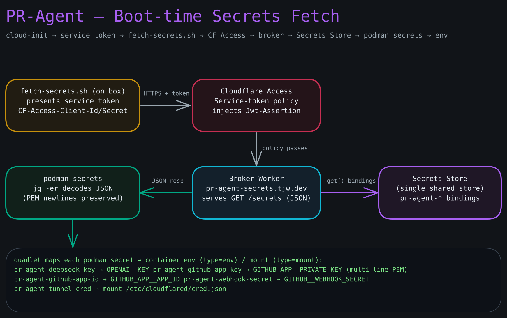

# Cloudflare — Tunnel, Access-Exempt Webhook, Shared Secrets Broker

**Goal:** Wire `pr-agent.tjw.dev` on Cloudflare and add this project to the **shared** secrets broker at `secrets.tjw.dev`. The webhook hostname must be **Access-EXEMPT** (GitHub cannot log in through Access), gated instead by the GitHub App's HMAC webhook secret. The broker stays **Access-gated** by a service token and is path-scoped per project — this box reads its bundle from `secrets.tjw.dev/secrets/pr-agent`. Along the way you create the tunnel, set the five `pr-agent` secrets as Worker secrets on the broker, deploy the broker Worker (which serves the `pr-agent` namespace), and verify a full fetch.

**Prerequisites:**

- `tjw.dev` is an active Cloudflare zone with DNS managed by Cloudflare.
- You are the account owner with Zero Trust enabled (if not, enable Zero Trust and add an identity provider first).
- `github-app.html` is complete: you hold the App ID, the private-key PEM, and the webhook secret.
- Node.js and `wrangler` **v4+** are available and authenticated locally (`cd secrets-broker && npm install && npx wrangler login`). Used to deploy the broker, create the OTP KV namespace, and set the broker's Worker secrets.
- The Cloudflare credential for wrangler can **Edit Workers** and **Workers KV** (no Secrets Store permission needed).

**Diagram — Boot-time secrets fetch path:**



> **One broker, many namespaces.** The broker at `secrets.tjw.dev` is shared across projects and scoped by path: `secrets.tjw.dev/secrets/pr-agent` returns only this project's five keys, and a bundle never sees another namespace's secrets. Adding a future project is a new entry in `secrets-broker/src/index.ts` plus its own Worker secrets — not a new hostname.
>
> **Two postures, do not mix them up.** `pr-agent.tjw.dev` faces GitHub's webhook senders, which are anonymous machines that cannot satisfy an Access login — so it is **exempt** from Access and protected by HMAC. `secrets.tjw.dev` faces only the Hetzner box at boot, which *can* present a service token — so it stays **behind Access**. Getting these backwards is the classic footgun: an Access-gated webhook hostname silently 302s every GitHub delivery to a login page (the App's **Recent Deliveries** shows a redirect, never a 200), and an exempt secrets hostname leaks every secret to the open internet.

---

## Part 1 — Create the Cloudflare Tunnel

**Step 1.** Install `cloudflared` locally if needed and log in:

```bash
brew install cloudflared
cloudflared tunnel login
```

**Step 2.** Create the tunnel:

```bash
cloudflared tunnel create pr-agent
```

You should see:

```
Created tunnel pr-agent with id <TUNNEL_UUID>
```

Note the **Tunnel UUID** — this is `TUNNEL_ID` in `deploy/config.env`, and it also fills `__TUNNEL_ID__` in `deploy/cloudflared/config.yml.template` (rendered by `deploy/render-config.sh`). The ingress in that template points `pr-agent.tjw.dev → http://localhost:3000` (the webhook port).

**Step 3 — Tunnel credential file.** The credential file lands at `~/.cloudflared/<TUNNEL_UUID>.json` and looks like `{"AccountTag":"...","TunnelID":"...","TunnelSecret":"..."}`. Its path becomes `TUNNEL_CRED_FILE` in `deploy/broker-secrets.vars` (Part 3) — its contents are set as the `TUNNEL_CRED` Worker secret. Confirm it exists:

```bash
cat ~/.cloudflared/<TUNNEL_UUID>.json
```

**Step 4 — DNS route.** Point the hostname at the tunnel:

```bash
cloudflared tunnel route dns pr-agent pr-agent.tjw.dev
```

You should see `Added CNAME pr-agent.tjw.dev which will route to this tunnel`. Confirm in the DNS dashboard that `pr-agent.tjw.dev` is a proxied (orange-cloud) CNAME to `<UUID>.cfargotunnel.com`.

**Step 5 — Update `deploy/config.env`.** Replace the placeholder with the real UUID and commit to `production`:

```bash
# deploy/config.env
TUNNEL_ID=<your-TUNNEL-UUID>
```

---

## Part 2 — Access posture: exempt the webhook, gate the broker

**Step 6 — Webhook hostname is Access-EXEMPT.** You have two equivalent ways to keep `pr-agent.tjw.dev` out of Access:

- **Simplest — never create an Access application for it.** If no Access application's domain matches `pr-agent.tjw.dev`, Access does not intercept it, and the tunnel serves it directly. Just confirm no existing application's domain (or wildcard) covers `pr-agent.tjw.dev`.
- **Explicit — a Bypass policy.** If a wildcard application (e.g. `*.tjw.dev`) would otherwise catch it, add a self-hosted Access application for `pr-agent.tjw.dev` whose single policy is **Action: Bypass**, selector **Everyone**. This documents the intent and overrides the wildcard.

Either way, the security model is: **GitHub's HMAC webhook secret is the gate**, verified inside PR-Agent (`GITHUB__WEBHOOK_SECRET`). Access adds nothing here because the caller is GitHub, which cannot authenticate to Access.

**Checkpoint.** From any machine, an unauthenticated request to the webhook path should reach PR-Agent (not a Cloudflare Access login page). A bare `GET /` returns PR-Agent's own response, and a forged `POST` to `/api/v1/github_webhooks` is rejected by PR-Agent's signature check, not by Access:

```bash
curl -si https://pr-agent.tjw.dev/ | head -3
# Expect an HTTP status line from PR-Agent (200/404/405) — NOT a 302 to *.cloudflareaccess.com
```

**Step 7 — Broker host stays Access-gated.** `secrets.tjw.dev` must accept **only** the machine service token. If the broker's Access application already exists, skip to Step 8 and simply add the `pr-agent-server` token as an allowed selector. To create it: **Access > Applications > Add an application > Self-hosted**:

```
Application name:    Secrets Broker (secrets.tjw.dev)
Application domain:  secrets.tjw.dev
```

Create a service-auth policy:

```
Policy name:  Broker service tokens
Action:       Service Auth
Selector:     Service Token — pr-agent-server (create it in Step 8)
```

> The broker is path-scoped, but Access gates the **hostname**, not the path — one service-token policy on `secrets.tjw.dev` covers every namespace. Each box still only ever fetches its own `/secrets/<project>` path.

**Step 8 — Service token.** Navigate to **Access > Service Auth > Service Tokens > Create Service Token**:

```
Token name:  pr-agent-server
Expiration:  Non-expiring  (or a long rotation interval)
```

Click **Generate token** and copy **both** values immediately — the secret is shown only once:

```
Client ID:      <CF_SERVICE_TOKEN_ID>
Client Secret:  <CF_SERVICE_TOKEN_SECRET>
```

Store them in your password manager. They are supplied to `deploy/gen-cloud-init.sh` (via `deploy/cloud-init.vars`) as `CF_SERVICE_TOKEN_ID` / `CF_SERVICE_TOKEN_SECRET`, land in `/etc/pr-agent/cf-service-token.env` on the box, and are what `deploy/fetch-secrets.sh` presents to the broker.

**Step 9.** Return to the `secrets.tjw.dev` application and confirm the `pr-agent-server` service token is an allowed selector. Save.

---

## Part 3 — Gather the app secrets

**Step 10.** The five `pr-agent` secrets are stored as **Cloudflare Worker secrets** on the broker, set by one script in Part 4 — **not** the Secrets Store. (A base64 RSA-2048 GitHub App PEM is ~2.2 KB, over the Secrets Store's **1024-char** value cap, and it cannot be compressed — it is random key material — so rather than split storage across two mechanisms, all five use the one uncapped mechanism. Worker secrets are encrypted at rest and write-only.) Here you only gather the values into a git-ignored vars file:

```bash
cp deploy/broker-secrets.vars.example deploy/broker-secrets.vars
$EDITOR deploy/broker-secrets.vars
```

Single-quote the inline values; the tunnel cred and PEM are **file paths** so their JSON/newlines are never mangled by the shell:

| Vars key | Value | Source |
|---|---|---|
| `DEEPSEEK_API_KEY` | DeepSeek API key (`sk-…`) | DeepSeek dashboard |
| `GITHUB_APP_ID` | GitHub App ID (number) | `github-app.html` Step 7 |
| `GITHUB_WEBHOOK_SECRET` | Webhook HMAC secret | `github-app.html` Step 3 |
| `TUNNEL_CRED_FILE` | path to `~/.cloudflared/<TUNNEL_UUID>.json` | Step 3 above |
| `GITHUB_APP_PRIVATE_KEY_FILE` | path to the downloaded `.pem` | `github-app.html` Step 8 |

> **No AES `ENCRYPTION_KEY` here** — PR-Agent is stateless and keeps no database, so there is nothing to encrypt and no never-rotate key to guard. To rotate any secret: edit `broker-secrets.vars`, re-run `set-broker-secrets.sh` (Step 14), then re-fetch on the box (with a fresh OTP — see `recovery.html`) and restart the container.

---

## Part 4 — Deploy the broker and set its secrets

The broker source lives in this repo at `secrets-broker/`. `secrets.tjw.dev` is deployed from here.

**Step 11.** Confirm `secrets-broker/wrangler.toml`: the route is the custom domain `secrets.tjw.dev`, `workers_dev = false`, and the only binding is `OTP_KV`. The five app secrets are **not** declared here — they are Worker secrets set in Step 14. The `pr-agent` namespace is registered in `secrets-broker/src/index.ts` (`BUNDLES["pr-agent"]`). No `[vars]` block — that would deploy plaintext and collide with the Worker secrets.

**Step 12 — Create the OTP KV namespace.** The broker enforces a single-use OTP per fetch (see `recovery.html` and the deployment spec), stored in Workers KV.

```bash
cd secrets-broker
npx wrangler kv namespace create OTP_KV   # prints an id
```

Put the id into `wrangler.toml` (`[[kv_namespaces]]` `OTP_KV`, replacing `REPLACE_WITH_OTP_KV_ID`) and into `deploy/cloud-init.vars` as `OTP_KV_ID`. `workers_dev = false` keeps the broker reachable solely via the Access-gated `secrets.tjw.dev` (no `*.workers.dev` bypass route).

**Step 13 — Deploy** (wrangler v4):

```bash
cd secrets-broker
npm install
npx wrangler deploy
```

The output should list the `OTP_KV` binding and `secrets.tjw.dev (custom domain)`.

**Step 14 — Set the five app secrets (one command).** Now that the Worker exists, set all five Worker secrets from your `broker-secrets.vars`:

```bash
bash deploy/set-broker-secrets.sh
```

It pipes each value to `wrangler secret put` (so nothing lands in shell history or `ps`), base64-encodes the PEM from its file, and sends the tunnel cred verbatim. Re-run it any time to rotate. Confirm: `(cd secrets-broker && npx wrangler secret list)` lists `DEEPSEEK_API_KEY`, `GITHUB_APP_ID`, `GITHUB_WEBHOOK_SECRET`, `TUNNEL_CRED`, `GITHUB_APP_PRIVATE_KEY`. `fetch-secrets.sh` on the box decodes the base64 PEM back to the real multi-line key before `podman secret create`.

**Step 15 — Confirm Access is enforced on the broker.** An unauthenticated request must be blocked:

```bash
curl -si https://secrets.tjw.dev/secrets/pr-agent | head -5
# Expect HTTP 302 (login redirect) or 403 — NOT 200. The Worker is never reached without the token.
```

---

## Part 5 — Verify a full fetch with the service token

**Step 16.** Verify the broker end to end with **one script** — no hand-typed values. `deploy/verify-broker.sh` reads `SECRETS_DOMAIN` / `SECRETS_NS` from `deploy/config.env` and the service token from `deploy/cloud-init.vars` (or the environment), mints a single-use OTP into the **remote** KV itself, fetches the bundle, and asserts all five keys are present and non-empty **and** that an immediate replay is rejected (consume-once):

```bash
# If you have not created deploy/cloud-init.vars yet (setup.html Section 3),
# export the service token from Step 8 first; otherwise the script reads it:
export CF_SERVICE_TOKEN_ID='<Client ID from Step 8>'
export CF_SERVICE_TOKEN_SECRET='<Client Secret from Step 8>'

bash deploy/verify-broker.sh
```

Expected:

```
[verify-broker] 200 + all 5 keys present and non-empty ✓
[verify-broker] replay rejected with 410 (consume-once) ✓
[verify-broker] OK — broker is wired correctly
```

A non-200 means the Access service-token policy (Steps 7–9) or the Worker secrets (Step 14, `set-broker-secrets.sh`) aren't in place yet — the script prints which to check. The broker serves only `/secrets/<namespace>` for a registered namespace, only behind Access, and only for a valid unused OTP, which it burns on use; any OTP failure is a uniform 410 and an unknown namespace is 404 (never leaking another project's keys).

---

## Revocation — kill switch

- **Service token compromised:** **Access > Service Auth > Service Tokens**, find `pr-agent-server`, **Revoke**. Re-provision a new token, update `CF_SERVICE_TOKEN_*` on the box, and re-run `deploy/fetch-secrets.sh` (mint a fresh OTP first — see `recovery.html`).
- **An app secret compromised (webhook secret, DeepSeek key, PEM, tunnel cred):** update its value in `deploy/broker-secrets.vars`, re-run `deploy/set-broker-secrets.sh` to push the new Worker secret, then re-fetch on the box (`recovery.html`, fresh OTP) and restart the container. Because the webhook hostname is Access-exempt, the HMAC webhook secret is the *only* thing standing between the open internet and a forged delivery — rotate it the moment you suspect exposure.
