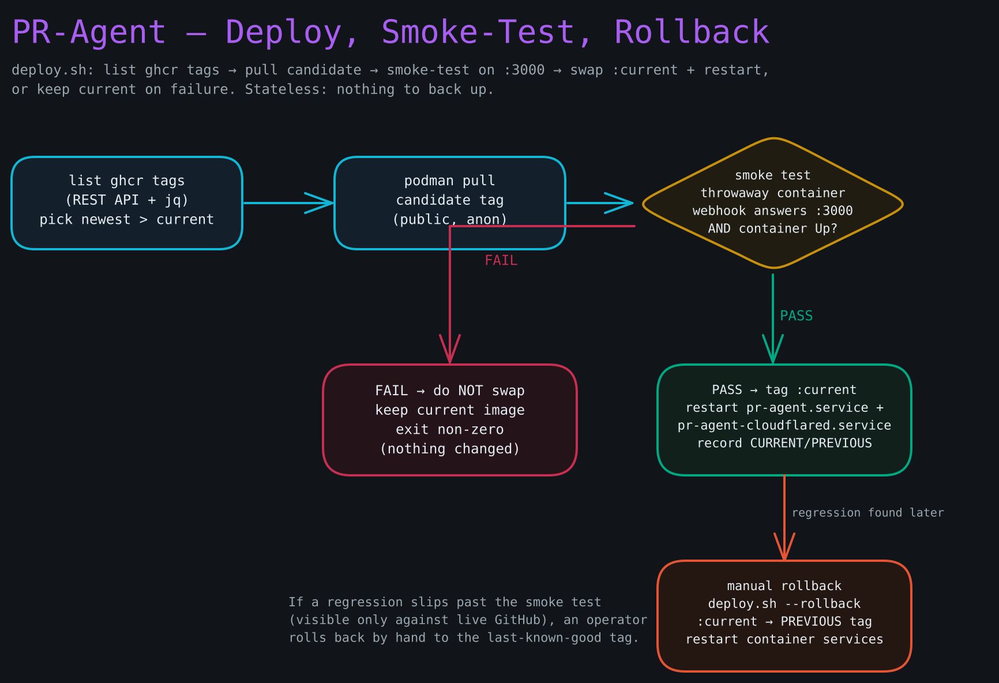

# Recovery Runbook

**Goal:** Restore PR-Agent to a working state when the automated smoke-test + rollback did not save you. Steps run from least to most invasive — work top to bottom and stop when the system is healthy.

PR-Agent is **stateless**: no database, no data volume, no backups. That changes the shape of recovery from CodeVibes — there is no DB to restore and no volume to reattach. Recovery here is always one of three moves: **roll back** to the last-known-good image, **re-fetch** the secrets, or **redeploy** from scratch on a fresh box. Because the box holds nothing precious, the fast path for a truly broken VM is simply to rebuild it from cloud-init.

**Diagram — Deploy, smoke-test, and rollback decision flow:**



---

## Step 1 — Triage: determine what is broken

SSH in and switch to the deploy user to see the systemd user units:

```bash
ssh root@<server-IP>
su - pragent
export XDG_RUNTIME_DIR=/run/user/$(id -u)
```

Check the container services and the pod:

```bash
systemctl --user status pr-agent.service pr-agent-cloudflared.service
podman ps -a --pod
```

You should see `pr-agent` and `pr-agent-cloudflared` in the `pragent` pod. Any container `Exited`/`Error` is the culprit. Read its logs:

```bash
journalctl --user -u pr-agent -n 100              # the app
journalctl --user -u pr-agent-cloudflared -n 100  # the tunnel
```

Run the smoke check manually — any HTTP status line means the webhook server is up (it has no health endpoint):

```bash
curl -s -o /dev/null -w '%{http_code}\n' http://localhost:3000/ && echo "answering" || echo "down"
```

If the logs show a `get_max_tokens` / "Model … not in MAX_TOKENS" error, the problem is config, not the image: `CONFIG__CUSTOM_MODEL_MAX_TOKENS` is unset or zero. Set v4-pro's real context window in `deploy/quadlet/pr-agent.container`, reinstall the unit, and restart (see Step 4's redeploy).

---

## Step 2 — Roll back to the last-known-good image

Use this when a recent deploy broke something the automatic smoke test did not catch (a regression visible only against live GitHub, say).

**Read the deploy-state ledger** (the only state PR-Agent keeps — no volume):

```bash
cat /var/lib/pr-agent/deploy-state
```

You should see:

```
CURRENT=v0.37.1
PREVIOUS=v0.37.0
```

**Roll back:**

```bash
bash ~/pr-agent/deploy/deploy.sh --rollback
```

You should see:

```
[deploy] rolling back to v0.37.0
[deploy] rollback complete
```

`--rollback` retargets the floating `localhost/pr-agent:current` tag to `PREVIOUS`, then restarts the **container** services (`pr-agent.service` and `pr-agent-cloudflared.service`) — not the pod service, which under Quadlet would leave the containers down.

**Verify:**

```bash
systemctl --user status pr-agent.service
curl -s -o /dev/null -w '%{http_code}\n' http://localhost:3000/
```

Then redeliver a `pull_request` event from the GitHub App's **Recent Deliveries** and confirm a review posts.

**If no previous tag exists** (first deploy, or the ledger is absent), list available tags from the public ghcr image and pin one by hand:

```bash
# Anonymous pull token for the public image, then list tags
REPO=thejustinwalsh/pr-agent
TOKEN=$(curl -fsS "https://ghcr.io/token?scope=repository:${REPO}:pull" | jq -r '.token')
curl -fsS -H "Authorization: Bearer ${TOKEN}" "https://ghcr.io/v2/${REPO}/tags/list" | jq '.tags'

# Pin to a known-good tag (replace v0.37.0)
podman pull ghcr.io/thejustinwalsh/pr-agent:v0.37.0
podman tag ghcr.io/thejustinwalsh/pr-agent:v0.37.0 localhost/pr-agent:current
systemctl --user daemon-reload
systemctl --user restart pr-agent.service pr-agent-cloudflared.service
```

---

## Step 3 — Re-fetch secrets

Use this when the container fails with authentication errors, unset env, unresolved `podman secret` references, a rotated GitHub App key/webhook secret, or after the Secrets Store was updated. This is also the fix when **webhook deliveries are rejected as bad signatures** — that means `GITHUB__WEBHOOK_SECRET` on the box no longer matches the App's webhook secret.

**Check which secrets exist:**

```bash
podman secret ls
```

You should see all five:

```
pr-agent-deepseek-key
pr-agent-github-app-key
pr-agent-github-app-id
pr-agent-webhook-secret
pr-agent-tunnel-cred
```

**Mint a fresh OTP first.** The boot OTP is single-use and was burned (and `/etc/pr-agent/otp.env` deleted) at first boot, so re-running `fetch-secrets.sh` alone returns 410. Mint a new one (from a machine with `wrangler` auth) and write it to `otp.env` on the box:

```bash
OTP="$(openssl rand -hex 32)"
HASH="$(printf %s "$OTP" | openssl dgst -sha256 -hex | sed 's/^.*= *//')"
npx wrangler kv key put --namespace-id="$OTP_KV_ID" "$HASH" pr-agent --ttl 3600
# on the box:
printf 'SECRETS_OTP=%s\n' "$OTP" | sudo tee /etc/pr-agent/otp.env >/dev/null
sudo chown pragent:pragent /etc/pr-agent/otp.env && sudo chmod 600 /etc/pr-agent/otp.env
```

**Re-run `fetch-secrets.sh`** (the service-token env lives in the root-owned file; `fetch-secrets.sh` sources `otp.env` itself and deletes it on success):

```bash
sudo bash -c '. /etc/pr-agent/cf-service-token.env; su - pragent -c "
  export XDG_RUNTIME_DIR=/run/user/\$(id -u)
  set -a
  . /etc/pr-agent/cf-service-token.env
  ~/pr-agent/deploy/fetch-secrets.sh
"'
```

You should see `[fetch-secrets] podman secrets created`. The multi-line GitHub App PEM rides through as a JSON string and is decoded back to real newlines by `jq -er` before `podman secret create` stores it — no re-encoding, so the key arrives in the container intact.

**Broker unreachable?** Fall back to manual bootstrap — it bypasses the broker entirely, so it needs **no OTP**. It reads the multi-line PEM straight from the downloaded file (it cannot be typed at a prompt) and prompts for the rest, none echoed:

```bash
~/pr-agent/deploy/bootstrap-secrets.sh /path/to/pr-agent.<date>.private-key.pem
```

**Restart to pick up the refreshed secrets:**

```bash
systemctl --user restart pr-agent.service pr-agent-cloudflared.service
systemctl --user status pr-agent.service
```

---

## Step 4 — Redeploy / rebuild from scratch

Use this when the image on the box is wrong, the units drifted, or the VM is unhealthy. Because PR-Agent is stateless, rebuilding loses nothing — there is no data to preserve.

**4a — In-place redeploy** (pull the latest good tag, smoke-test, swap, restart):

```bash
su - pragent
export XDG_RUNTIME_DIR=/run/user/$(id -u)
bash ~/pr-agent/deploy/deploy.sh
```

`deploy.sh` lists ghcr tags via the REST API, boots the candidate in a throwaway container, polls the webhook on a smoke port until it answers (and confirms the container is still Up), then swaps `:current` and restarts the container services. If the smoke test fails it keeps the current image and exits non-zero — nothing changes.

**4b — Reinstall the quadlet units** (after editing `deploy/quadlet/*`, e.g. fixing `CONFIG__CUSTOM_MODEL_MAX_TOKENS`):

```bash
cd ~/pr-agent && git pull origin production
cp ~/pr-agent/deploy/quadlet/*.pod ~/pr-agent/deploy/quadlet/*.container ~/.config/containers/systemd/
cp ~/pr-agent/deploy/quadlet/*.timer ~/pr-agent/deploy/quadlet/*.service ~/.config/systemd/user/
(cd ~/pr-agent/deploy && ./render-config.sh)   # re-render cloudflared config
systemctl --user daemon-reload
systemctl --user restart pr-agent.service pr-agent-cloudflared.service
```

**4c — Full box rebuild** (VM dead or beyond repair): there is no volume to reattach and nothing to restore. Just create a fresh CX22 from cloud-init per **Section 3 of `setup.html`**. Cloud-init re-clones the fork, reinstalls the units, re-fetches the secrets from the broker, and runs the first deploy. The new box reaches the same healthy state with no data migration. Update the GitHub App's webhook only if the hostname changed (it does not — the tunnel keeps `pr-agent.tjw.dev`).

---

## Quick-reference commands

```bash
# Container + pod status
systemctl --user status pr-agent.service pr-agent-cloudflared.service
podman ps -a --pod

# Live logs
journalctl --user -u 'pr-agent*' -f

# Roll back to last-known-good
bash ~/pr-agent/deploy/deploy.sh --rollback

# Redeploy latest good tag (smoke-tested)
bash ~/pr-agent/deploy/deploy.sh

# Re-fetch secrets from the Cloudflare broker (CF_SERVICE_TOKEN_* in env;
# mint a fresh single-use OTP into /etc/pr-agent/otp.env first — see above)
~/pr-agent/deploy/fetch-secrets.sh

# Manual secret bootstrap (broker down) — PEM read from file
~/pr-agent/deploy/bootstrap-secrets.sh /path/to/github-app-private-key.pem

# Webhook server answering? (any HTTP code = up)
curl -s -o /dev/null -w '%{http_code}\n' http://localhost:3000/

# Deploy-state ledger (the only persisted state)
cat /var/lib/pr-agent/deploy-state

# List podman secrets
podman secret ls
```
