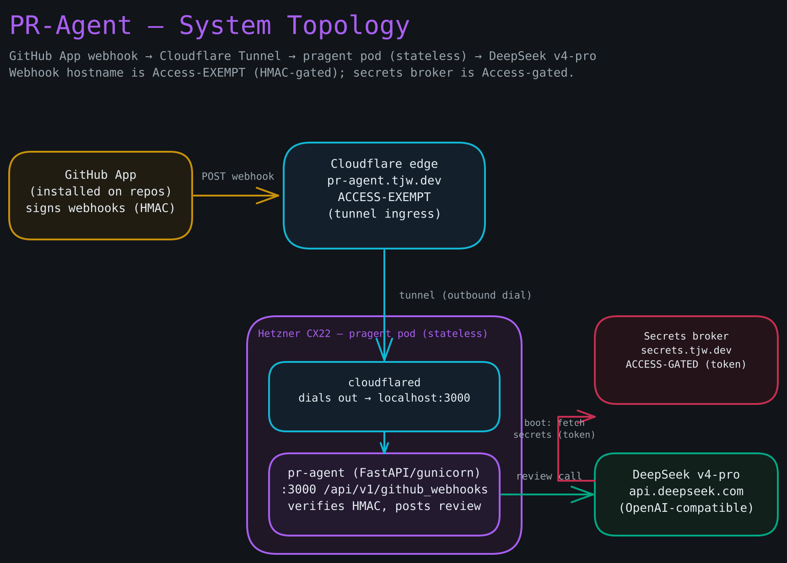

# End-to-End First Deploy — Setup Runbook

**Goal:** Take `pr-agent.tjw.dev` from nothing to a running, self-hosted PR-Agent webhook server on a Hetzner CX22, behind Cloudflare Tunnel, reviewing PRs with DeepSeek **v4-pro**. Complete the sections **in order** — each depends on the prior one.

PR-Agent is **stateless**: there is no data volume and no backup. The only persisted state is the deploy-state ledger under `/var/lib/pr-agent`. That simplifies this runbook relative to CodeVibes — no volume to create, attach, or restore.

**Prerequisites:**

- macOS with Homebrew, `git`, `gh` CLI, `jq`, `node`, `openssl`, `cloudflared`, `pandoc` installed.
- `wrangler` **v4+** authenticated to your Cloudflare account (`cd secrets-broker && npm install`; `npx wrangler login`). Used to deploy the broker, create the OTP KV namespace, and mint the per-provision OTP during `gen-cloud-init.sh`.
- A Cloudflare account with `tjw.dev` as an active zone.
- A Hetzner Cloud account.
- The fork `thejustinwalsh/pr-agent` exists with a `production` branch.

**Diagram — Full system topology:**



---

## Section 1 — GitHub App and image

### Step 1 — Create the public fork and `production` branch

Fork `The-PR-Agent/pr-agent` to `thejustinwalsh/pr-agent`. Keep it **public** — the ghcr image is public and pulled anonymously by the server, which forces the no-secrets-in-image discipline. Create `production`:

```bash
git clone https://github.com/thejustinwalsh/pr-agent.git
cd pr-agent
git checkout -b production
git push -u origin production
```

### Step 2 — Create and install the GitHub App

**Complete `github-app.html` in full now.** It registers the GitHub App (permissions, the `pull_request` / `issue_comment` events, the Webhook URL `https://pr-agent.tjw.dev/api/v1/github_webhooks`, the webhook secret, and the private-key PEM), and installs the App on your target repos. You finish that runbook holding: the App ID, the private-key PEM file, the webhook secret, and your DeepSeek API key.

### Step 3 — Verify CI and build the first image

Push `production` with `.github/workflows/` in place. At `https://github.com/thejustinwalsh/pr-agent/actions`, confirm both workflows appear (`sync-upstream` and `build-image`). Trigger a sync to confirm it reaches the right upstream:

```bash
# `gh workflow run` matches the workflow's name/filename/ID, not the basename —
# the workflow is named `sync-upstream` (file: sync.yml), so `sync` won't resolve.
gh workflow run sync-upstream --repo thejustinwalsh/pr-agent --ref production
```

Create a release tag matching upstream to trigger the build:

```bash
gh release create v0.37.0 --repo thejustinwalsh/pr-agent \
  --title "v0.37.0" --notes "Initial production build"
```

The `build-image` workflow runs `patches/apply.sh` (a fail-loud no-op asserting codemod — PR-Agent honors `CONFIG__MODEL`/`OPENAI__API_BASE` without a source rewrite) and builds `docker/Dockerfile --target github_app` → `ghcr.io/thejustinwalsh/pr-agent:<tag>` + `latest`.

### Step 4 — Make the package public and verify an anonymous pull

At `https://github.com/thejustinwalsh?tab=packages`, open the `pr-agent` package > **Package settings** > **Danger Zone** > set visibility to **Public**. Verify:

```bash
podman pull ghcr.io/thejustinwalsh/pr-agent:v0.37.0   # must pull with no login
```

---

## Section 2 — Cloudflare: tunnel, Access posture, secrets

**Complete `cloudflare.html` in full now.** It:

1. Creates the `pr-agent` tunnel and the `pr-agent.tjw.dev` DNS route (ingress → `http://localhost:3000`).
2. Keeps `pr-agent.tjw.dev` **Access-EXEMPT** (HMAC-gated by the webhook secret) and the shared broker `secrets.tjw.dev` **Access-gated** by the `pr-agent-server` service token.
3. Populates the four small `pr-agent-*` secrets in the account Secrets Store, and sets the GitHub App PEM as a **Worker secret** (it exceeds the Store's 1024-char limit).
4. Creates the `OTP_KV` namespace (Step 12a), sets its id in `wrangler.toml` + `deploy/cloud-init.vars`, then deploys the shared broker Worker (serving the `pr-agent` namespace, single-use OTP enforced, `workers_dev = false`) and verifies a full fetch with a hand-minted OTP.

**Deploy the broker before provisioning the box** (Section 3): a fresh box's first boot fetches from it. After this section you have: `CF_SERVICE_TOKEN_ID` / `CF_SERVICE_TOKEN_SECRET` in your password manager, the `TUNNEL_ID` (UUID) in `deploy/config.env`, the `OTP_KV_ID` (from `wrangler kv namespace create OTP_KV`), and `secrets.tjw.dev/secrets/pr-agent` returning the five keys for a valid OTP.

### Step 5 — Set the v4-pro context window (MANDATORY)

`deepseek-v4-pro` is not in PR-Agent's built-in `MAX_TOKENS` table, so PR-Agent's `get_max_tokens()` **raises** unless `CONFIG__CUSTOM_MODEL_MAX_TOKENS` is set to a positive value. This is already set to v4-pro's context window (1,000,000) in `deploy/quadlet/pr-agent.container`; just confirm it before deploying:

```bash
grep CUSTOM_MODEL_MAX_TOKENS deploy/quadlet/pr-agent.container
# Environment=CONFIG__CUSTOM_MODEL_MAX_TOKENS=1000000
```

This single value covers both the primary `deepseek-v4-pro` and the `deepseek-v4-flash` fallback (neither is in the built-in table). If you change it, commit to `production`.

---

## Section 3 — Hetzner: render cloud-init and create the box

### Step 6 — Render the cloud-init document

On your Mac, create `deploy/cloud-init.vars` (git-ignored). `OTP_KV_ID` is the id from `wrangler kv namespace create OTP_KV` (Section 2, Step 12a):

```bash
cat > deploy/cloud-init.vars <<'EOF'
CF_SERVICE_TOKEN_ID=<your CF_SERVICE_TOKEN_ID>
CF_SERVICE_TOKEN_SECRET=<your CF_SERVICE_TOKEN_SECRET>
FORK_REPO=thejustinwalsh/pr-agent
TUNNEL_ID=<your TUNNEL_UUID>
OTP_KV_ID=<your OTP_KV namespace id>
SECRETS_NS=pr-agent
EOF
```

Render it. `gen-cloud-init.sh` **mints a single-use OTP** (`wrangler kv key put`, 1h TTL) into the `OTP_KV` namespace and injects it — so `wrangler` must be authenticated (Prerequisites) and the broker must already be deployed (Section 2). A failed mint emits no file:

```bash
bash deploy/gen-cloud-init.sh deploy/cloud-init.vars /tmp/cloud-init-pr-agent.yaml
```

You should see `gen-cloud-init: wrote /tmp/cloud-init-pr-agent.yaml (XXXX bytes)` followed by `OTP valid 60 minutes — paste into Hetzner and boot within the window.` Confirm it is under 32 KiB and free of leftover placeholders (the script already asserts both, but verify):

```bash
wc -c /tmp/cloud-init-pr-agent.yaml      # must be < 32768
grep "__" /tmp/cloud-init-pr-agent.yaml  # must produce no output
```

> **The OTP is valid for 1 hour.** Create the Hetzner box (Step 7) and let it boot promptly. If the box does not provision within the window, the first fetch returns 410 — just re-run this render command (it mints a fresh OTP) and re-create the box with the new cloud-init.

### Step 7 — Create the CX22 server

In the [Hetzner Cloud Console](https://console.hetzner.cloud), **Create Server**:

```
Location:     Falkenstein (fsn1)
Image:        Ubuntu 26.04
Type:         CX22  (2 vCPU, 4 GB RAM, 40 GB NVMe)
Public IP:    ENABLE IPv4 (GitHub & ghcr.io are IPv4-only — an IPv6-only box
              cannot git clone or podman pull, so cloud-init would fail)
SSH keys:     add your public key
Cloud config: paste the contents of /tmp/cloud-init-pr-agent.yaml
Volumes:      NONE — PR-Agent is stateless, no volume to attach
Firewall:     SSH is key-only + fail2ban (set by cloud-init); do NOT pin a source IP
              (fragile behind iCloud Private Relay → lockout). If you attach a Cloud
              Firewall: allow TCP 22 from 0.0.0.0/0 and ::/0, allow ICMP. No inbound
              ports for the app — the tunnel dials out.
```

Click **Create & Buy now**.

---

## Section 4 — Verify the deploy and the first webhook delivery

### Step 8 — Watch cloud-init complete

```bash
ssh root@<server-IP>
tail -f /var/log/cloud-init-output.log
```

Cloud-init clones the fork's `production` branch, installs the quadlet units + timers, renders the cloudflared config, fetches the secrets, and runs the first deploy. It is done when you see `Cloud-init v. X.X finished`. Expect 3–5 minutes.

### Step 9 — Verify the pod and containers

```bash
su - pragent
export XDG_RUNTIME_DIR=/run/user/$(id -u)
systemctl --user status pr-agent.service pr-agent-cloudflared.service
podman ps --pod
```

You should see two containers — `pr-agent` and `pr-agent-cloudflared` — in the `pragent` pod, both **active (running)**. Confirm the secrets exist:

```bash
podman secret ls
# pr-agent-deepseek-key, pr-agent-github-app-key, pr-agent-github-app-id,
# pr-agent-webhook-secret, pr-agent-tunnel-cred
```

The single-use OTP was consumed and removed on first fetch — confirm it's gone:

```bash
test ! -e /etc/pr-agent/otp.env && echo "OTP burned (expected)"
```

### Step 10 — Local smoke: the webhook server answers on :3000

```bash
curl -s -o /dev/null -w '%{http_code}\n' http://localhost:3000/
```

Any HTTP status line (200/404/405) means gunicorn/uvicorn is up and serving — the GitHub-App receiver has no health endpoint, so *any* response proves the worker is alive. `000` means nothing is listening; check `journalctl --user -u pr-agent -n 100`.

### Step 11 — First webhook delivery from GitHub

In the GitHub App's **Advanced > Recent Deliveries** tab, find the `ping` delivery sent at installation; it should show **200**. Then open (or reopen) a pull request on an installed repo. Within a few seconds PR-Agent posts a DeepSeek **v4-pro** review comment.

Watch it happen from the server:

```bash
journalctl --user -u pr-agent -f
```

You should see the inbound `pull_request` event accepted (HMAC verified), the model call to `https://api.deepseek.com`, and the review posted back. That closes the loop: GitHub → tunnel → pr-agent (HMAC-verified, Access-exempt) → DeepSeek v4-pro → review comment.

---

## Troubleshooting quick reference

| Symptom | Check |
|---|---|
| Cloud-init hangs | `journalctl -u cloud-init` on the server |
| Container not starting | `systemctl --user status pr-agent.service` as `pragent`; then `journalctl --user -u pr-agent -n 100` |
| `get_max_tokens` error in logs | `CONFIG__CUSTOM_MODEL_MAX_TOKENS` is unset/zero — set v4-pro's real window (Step 5), redeploy |
| Tunnel not connecting | `journalctl --user -u pr-agent-cloudflared` |
| Webhook deliveries 302 to a login page | Webhook hostname is NOT Access-exempt — fix in `cloudflare.html` Part 2 |
| Webhook deliveries rejected as bad signature | `GITHUB__WEBHOOK_SECRET` ≠ the App's webhook secret — re-fetch secrets (`recovery.html`) |
| Secrets missing | `podman secret ls`; re-run `deploy/fetch-secrets.sh` after minting a fresh OTP (`recovery.html`) |
| Cloud-init failed at the secrets fetch (410) | OTP expired (>1h) or already used — re-run `gen-cloud-init.sh` for a fresh OTP and re-create the box (Step 6) |
| `gen-cloud-init.sh` fails: `OTP_KV_ID … required` / wrangler error | Set `OTP_KV_ID` in `cloud-init.vars`; ensure `wrangler` is logged in (Prerequisites) and the `OTP_KV` namespace exists |
